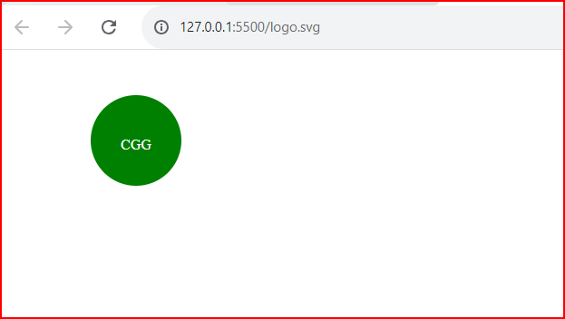

# OOPSVGLogoMakerCG
An app to generate a simple logo in svg format for projects.

## User Story

AS a freelance web developer
I WANT to generate a simple logo for my projects
SO THAT I don't have to pay a graphic designer.

## Acceptance Criteria

```md
GIVEN a command-line application that accepts user input
WHEN I am prompted for text
THEN I can enter up to three characters
WHEN I am prompted for the text color
THEN I can enter a color keyword (OR a hexadecimal number)
WHEN I am prompted for a shape
THEN I am presented with a list of shapes to choose from: circle, triangle, and square
WHEN I am prompted for the shape's color
THEN I can enter a color keyword (OR a hexadecimal number)
WHEN I have entered input for all the prompts
THEN an SVG file is created named `logo.svg`
AND the output text "Generated logo.svg" is printed in the command line
WHEN I open the `logo.svg` file in a browser
THEN I am shown a 300x200 pixel image that matches the criteria I entered
```


## Mock-Up

The following image shows a mock-up of the generated SVG given the following input entered by the user: `SVG` for the text, `white` for the text color, `circle` from the list of shapes, and `green` for the shape color. 



## Additional Requirements


* Walkthrough video that demonstrates the functionality of the SVG logo maker can be be checked in: https://drive.google.com/file/d/1KmEAzPgXcwl_z3qTI3vR5x8DiVPYA6PR/view?usp=sharing

* The URL of the GitHub repository is: https://github.com/Camila-Maria-Pilar/OOPSVGLogoMakerCG.git
